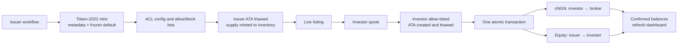

# Rabovel demo

Rabovel demonstrates a primary market for tokenized equities: an issuer defines an asset, submits simulated backing evidence, creates and funds its on-chain inventory, and publishes a live listing. An approved mock-KYC investor can connect a wallet, review the backing and simulated price, buy with cNGN, and see the resulting holding and portfolio value.

> Demo only: backing verification, market prices and KYC approval are simulated. The tokens do not represent a legal claim on real shares.

## Solana flow

Each equity/share class has a **zero-decimal Token-2022 mint**. Rabovel uses external Token ACL and ABL Gate programs for eligibility; there is currently no custom Rabovel on-chain program.

### Instructions and ownership

| Stage | On-chain operations | Required authority |
| --- | --- | --- |
| Mint setup | System `CreateAccount`; Token-2022 metadata pointer, frozen default, pausable and inactive transfer-hook extensions; `InitializeMint2`; token metadata | Admin pays; mint keypair and issuer sign |
| Eligibility | ACL `CreateConfig`; Gate list creation, extra-meta setup and allow-list entry; permissionless ACL thaw | Rabovel demo admin |
| Issuance | Idempotent issuer ATA creation, ACL thaw, Token-2022 `MintToChecked` | Admin pays/setup; issuer mint authority signs |
| Purchase | Idempotent investor ATA creation, allow-list entry and thaw; two `TransferChecked` legs in one transaction | Issuer signs equity leg; linked investor wallet signs cNGN leg and pays the transaction fee |

Solana program ownership and asset ownership are kept separate:

- Token-2022 owns mint and token-account data; each token account records its wallet owner and mint.
- Associated Token Account derivation binds the expected wallet, mint and token program; the API reads these accounts back and rejects mismatched program owners, wallet owners or mints.
- ACL/Gate state is held in program-derived accounts owned by those external programs. The ACL MintConfig PDA becomes the mint freeze authority.
- The API accepts an investor-signed settlement only when its fee payer matches the wallet previously linked through wallet-ownership proof, and Solana verifies every required signature.
- No permanent delegate can move holder balances. Admin controls eligibility/pause operations; the issuer controls minting and its inventory transfer.

## Future state

A production version could replace simulated KYC, backing and prices with regulated providers and audited custody; move keys to HSM/MPC or qualified custodians; add durable order, settlement and reconciliation ledgers; and activate a reviewed transfer hook or settlement program with per-trade authorization, replay protection and controlled recovery. Legal share rights, corporate actions, secondary trading, monitoring and disaster recovery would also require production-grade operating and regulatory frameworks.

The Next.js frontend is in `rabovel-FE`; the companion `rabovel-BE` service owns API policy, Solana transaction construction and RPC verification.
