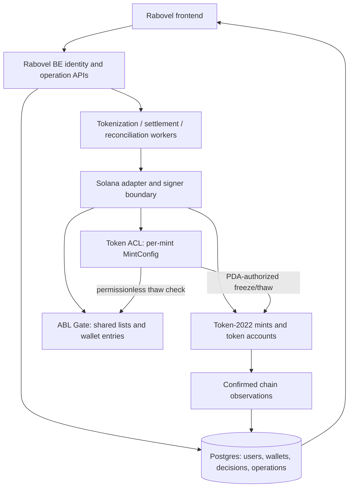

# Rabovel on-chain reference: equity setup, issuance and holder eligibility

**Canonical design and integration reference. Consolidated 2026-09-23; foundation imported into rabovel-BE.**

The selected adapter source, examples, tests and runbooks now live in this repository. Legacy rabo-chain API, persistence, frontend, settlement adapter and eligibility-hook program were intentionally not imported. References to that legacy implementation below are historical, not local dependencies. See [import scope](README.md).

This is the single reference for the on-chain decisions agreed during the rabo-chain work. It replaces conflicting on-chain recommendations in earlier demo notes, audits, walkthroughs and ADRs. It does not silently replace unrelated product decisions or prove that a design is implemented.

**Read labels literally:** “Agreed” describes our selected design; “implemented” means code exists; “verified on-chain” requires a recorded validator/cluster run. Integration recommendations and unresolved decisions are labelled separately. Update this document when a decision changes; keep commands in the linked runbooks rather than creating competing specifications.

## 1. What we are building

**Agreed:** a Solana settlement and tokenization slice that rabovel-BE can call. It creates representations of equities, issues backed demo inventory, lets eligible wallets participate through their token accounts, and eventually settles matched trades atomically.

- One Token-2022 mint per distinct equity/share class and representation arrangement. A ticker alone is not a globally unique instrument identity.
- Examples: `rDANGCEM` and a separate BUA Cement mint.
- One token represents one **simulated beneficial entitlement to one ordinary share**.
- Decimals are **0**, superseding the early suggestion of 10.
- Mint creation starts supply at **0**. Issuing 1,000 shares is a later operation, not a mint default or cap.
- Backing/custody are simulated. Demo issuer names do not imply actual issuer authorization.
- Display: **Prototype / simulated assets / not an offering / not SEC-approved.**

Token metadata and technical restrictions do not establish shareholder rights, custody, regulatory approval or legal ownership of real shares. Production legal, custody and market-structure design remains separate work.

## 2. Why Token-2022, SDK instructions and Token ACL

**Token-2022** supplies the mint/token-account model and the extensions we selected. Rabovel uses the Rust SDK to construct instructions addressed to existing programs. We do not need a new Anchor program simply to create a mint. Anchor may be useful for future custom settlement logic; it is not the token-account owner or a replacement for Token-2022.

Responsibilities:

| Component | Responsibility |
|---|---|
| Token-2022 | Mint data, balances, issuance, transfers and native freeze/pause enforcement |
| Token ACL | Delegated freeze authority, administrative operations and Gate-checked permissionless operations |
| ABL Gate | On-chain allow/block membership checks for account activation |
| Future settlement hook | Transfer-specific settlement authorization, when designed and activated |
| Rabovel backend | Identity, wallet binding, KYC decisions, signing/orchestration, backing evidence and reconciliation |
| Frontend | Request operations and display accurately confirmed or pending results |

**Token ACL is a separate program, not a mint extension.** The Gate checks membership during the relevant freeze/thaw operation, rather than running on every ordinary transfer. This avoids adding a hook merely to repeat our account-activation check. It is not a claim that every ACL operation is universally cheaper than every possible hook.

“Who may hold” is shorthand for controlled account participation. A revoked holder can retain a frozen balance; blocking does not automatically confiscate or burn tokens.

## 3. Accounts and identities

A Solana account's **program owner** and a token account's **holder/authority field** are different concepts. Token-2022 owns mint and token-account data; an investor's wallet ordinarily authorizes spending from their token account.

| Account/identity | Scope | Program owner / control | Purpose |
|---|---|---|---|
| Rabovel Admin signing identity | Deployment | Local signer in demo | ACL/list administration, pause and hook-update permissions; fee payer in current commands |
| Demo issuer signing identity | Issuer | Local signer in demo | Minting and metadata authority |
| Equity mint | Equity representation | Token-2022 | Asset identity, supply, decimals, authorities and extensions |
| MintConfig PDA | Mint | Token ACL | Mint, administrative authority, Gate address and permissionless flags |
| Allow-list configuration PDA | Deployment | ABL Gate; Admin administers | Shared approved-wallet list |
| Block-list configuration PDA | Deployment | ABL Gate; Admin administers | Shared restricted-wallet list |
| Wallet-entry PDA | List + wallet | ABL Gate | Membership in one particular list |
| Gate thaw account-metadata PDA | Mint | ABL Gate | Describes additional accounts needed for its thaw checks, including list configuration |
| Broker inventory/treasury token account | Broker wallet + mint | Token-2022; broker wallet is holder authority | Holds issued inventory awaiting distribution/settlement |
| Investor token account | Wallet + mint | Token-2022; investor wallet is holder authority | Holds that wallet's units of one asset |
| Payment token account | Wallet + payment mint | Relevant token program | Holds payment tokens, separate from equities |
| Future settlement PDA / hook account metadata | Future settlement design | Custom program, not yet finalized | Authenticated settlement state and transfer-time account resolution |

Use associated token accounts (ATAs) for normal broker and investor provisioning. An ATA is derived from wallet, token program and mint. Other token accounts can exist: controls and revocation must not assume the ATA is the wallet's only holding account.

Alice holding Dangote, BUA and demo naira normally has **three token accounts for three distinct mints**. Her wallet address is not any of those mint addresses.

The “shared pair” means **one allow list plus one block list**, reused across equities in an environment. It does not mean a user-ID/wallet pair. Environments have separate chain state; include network/deployment identity in persisted mappings.

## 4. Authority decisions

| Permission | Agreed authority |
|---|---|
| Mint additional equity tokens | Configured demo issuer, e.g. Demo Dangote Issuer |
| Update TokenMetadata | Same configured demo issuer |
| Update MetadataPointer | Same configured demo issuer |
| Initial native mint freeze authority | Rabovel Demo Admin |
| Native freeze authority after ACL handover | That mint's Token ACL MintConfig PDA |
| MintConfig administrative authority | Rabovel Demo Admin |
| Administer allow/block lists | Rabovel Demo Admin |
| Pause/resume the equity mint | Rabovel Demo Admin |
| Update, activate or disable transfer-hook program | Rabovel Demo Admin |
| Spend broker inventory | Broker wallet authority; signing model to be wired |
| Spend investor holdings | Holder or an explicitly authorized delegate/signing arrangement |
| Upgrade deployed program code | Separate deployment authority; not implied by any mint authority |

The MintConfig field named `freeze_authority` stores the **administrative key**. The mint's native freeze-authority field points to the **MintConfig PDA**. These must not be confused.

`Authority { role, address }` is descriptive data. A caller labelling their own address `RabovelAdmin` proves nothing. The mint builder checks the role and address against separately configured trusted admin/issuer identities. Required transaction signatures provide authorization on-chain.

A mint keypair identifies/signs creation of the mint account. It is not the ongoing minting authority. PDAs have no private keys; the controlling program signs for them through program-derived signing.

Roles may share a key in a demo without becoming the same permission. Signer lists are deduplicated by public key, not by role. Authority rotations must be authorized and reconciled with configuration; no automatic rotation workflow exists yet. Do not grant actual issuers, brokers or government bodies authority merely because they were mentioned as future possibilities.

## 5. Selected mint extensions and metadata

| Extension | Decision / initial value |
|---|---|
| MetadataPointer | Included; points to the mint itself; issuer update authority |
| TokenMetadata | Included on the mint; issuer update authority |
| DefaultAccountState | Included; new token accounts start Frozen |
| Pausable | Included; initially unpaused; Rabovel Admin controls pause/resume |
| TransferHook | Included at mint creation; `program_id = None`; Admin retains update authority |
| PermanentDelegate | **Omitted**; no mint-wide forced-transfer/burn power |
| Scaled UI Amount, confidential features, transfer fees, other extensions | Not selected for this demo |

Pausable provides a mint-wide halt for supported token operations such as transfer, mint and burn. Freezing targets individual token accounts. Neither should be described as deleting balances or replacing revocation workflows.

Metadata contains name, symbol, mint, update authority, URI and `additional_metadata: Vec<(String, String)>`. Empty additional metadata is an empty vector, not a separate optional state. The pointer and token metadata are separate extensions.

Intended URI: hosted JSON containing description, imagery, market/ticker, representation ratio and disclosures; the complete disclosure schema is not finalized. The current local fixture uses an explicitly invalid placeholder URL: it has not been published.

Account creation allocates the fixed mint/extension space. Rent funding covers the larger required size including variable metadata; metadata initialization/updates grow the account. Extensions that require pre-initialization are initialized before `initialize_mint2`, then token metadata is initialized. `initialize_mint2` avoids an explicit Rent sysvar account; the “2” does not mean Token-2022.

**An inactive hook enforces no settlement restriction.** After thawing, ordinary owner-authorized transfers can occur subject to native token controls. Do not advertise settlement-only transfers until the hook and settlement protocol are implemented and tested. Activating a hook later requires compatible code and its extra-account resolution setup; extension presence alone supplies neither.

## 6. Shared eligibility policy and Gate setup

**Agreed:** reuse the standard ABL Gate implementation. We have not identified a need to modify Token ACL or write a custom Gate for the demo. Sharing executable code does not share another application's lists: Rabovel creates its own list accounts under its Admin.

| Rule | Agreed value |
|---|---|
| Allow list | One shared Rabovel list per environment |
| Block list | One shared Rabovel list per environment |
| Eligible for Gate-approved thaw | Wallet is allowed AND not blocked |
| Both lists contain the wallet | Block wins |
| Neither list contains the wallet | Thaw denied |
| Permissionless thaw | Enabled after Gate setup is verified |
| Permissionless freeze | Disabled |
| Administrative freeze | Rabovel Admin authorizes through Token ACL |
| Broker exemption | None; broker goes through the same eligibility checks |

An empty allow list admits nobody through the Gate. “Permissionless” means no privileged Admin approval signature is needed for each successful Gate-checked thaw; the transaction still has required signers and a fee payer. It does not mean bypassing eligibility.

Creation instructions execute through a signed transaction. Preparing them does not create accounts. List creation produces list configuration accounts; later list-update instructions create/remove wallet membership records.

Reference derivations for the reviewed implementation:

- ACL MintConfig: `["MINT_CONFIG", mint]`, under Token ACL.
- ABL list: `["list_config", admin, list_seed]`, under ABL Gate.
- Wallet entry: `["wallet_entry", list_config, wallet]`, under ABL Gate.

Allow and block use **distinct saved public seeds** because list mode is not part of the list PDA derivation. These seeds are neither user identifiers nor signing keys. Reuse the same seeds and list addresses for subsequent equity setups. Do not regenerate them on RPC timeouts.

Gate thaw extra-account metadata and a future transfer hook's ExtraAccountMetaList are different accounts/interfaces. Neither is the asset's descriptive metadata. Any additional SDK-required accounts, including ACL's permissionless-operation flag account in the reviewed version, must be resolved according to that exact interface; they are not user-ID mappings.

The current ACL `create_config` atomically creates MintConfig and transfers native freeze authority from the current authority to its PDA. Both permissionless flags initially remain false. The final target enables thaw only after the Gate/list association is configured. This intermediate state is expected, not the final demo policy.

Administrative ACL operations are privileged paths: do not claim the Gate prevents the Admin from administratively thawing an account. Normal Rabovel onboarding must use the Gate-checked path rather than taking that bypass.

## 7. End-to-end equity setup and issuance

**Agreed target flow; not all steps are implemented.**

1. Load trusted deployment/admin configuration and resolve the instrument's authorized demo issuer. Use backend-controlled instrument-to-issuer mapping, not client-provided authority labels or arbitrary keypair paths.
2. Ensure compatible Token ACL and ABL Gate programs exist on the selected chain. Create/verify the shared lists once for that deployment.
3. Save the mint identity before submitting creation. Create the zero-supply Token-2022 mint with the extensions and authorities above; confirm and read back its state.
4. Create its ACL MintConfig and delegate freeze authority. Confirm/read back the PDA, administrative key, Gate and native mint authority.
5. Configure that mint's ABL Gate thaw account metadata to reference both shared lists. Verify it, then enable permissionless thaw while keeping permissionless freeze disabled.
6. Resolve the broker's verified wallet. Add it to the shared allow list through an Admin-authorized transaction and confirm membership; ensure it is not blocked.
7. Create the broker's equity ATA. It begins frozen. Thaw through Token ACL and ABL Gate. This is the broker inventory/treasury account; no separate treasury mint is required.
8. Record and allocate sufficient simulated backing. Issue the requested whole-share amount to that treasury with the issuer's mint authority.
9. Confirm the issuance and reconcile on-chain supply, broker balance and allocated backing. Persist instrument, mint, treasury and transaction mappings before presenting the setup as ready.

The treasury belongs to the broker wallet selected for the instrument's custody/inventory arrangement. It is mapped to the broker's backend identity off-chain; the broker user ID does not belong in the mint or wallet-entry PDA. Multiple-broker custody details remain to be finalized.

At a 1:1 ratio, `on_chain_supply <= verified_allocated_simulated_backing`. Unissued allocated backing may exceed supply. Broker inventory counts toward supply just like investor holdings. A balanced reconciliation does not verify actual custody.

Mint-authority holders can technically mint using their signing authority. The backing invariant is not automatically enforced by Token-2022; the backend issuance controls and reconciliation must enforce it in the demo. Stronger on-chain issuance constraints would require another explicit design decision.

## 8. Holder onboarding, transfer and revocation

### Approved holder

1. Backend verifies the user-to-Solana-wallet binding and receives an approved KYC result.
2. Backend records approval and submits an Admin-signed allow-list update. “KYC completed” or a frontend boolean is insufficient.
3. Backend confirms on-chain membership. Approved-off-chain and applied-on-chain are separate statuses.
4. Create the wallet's ATA for the selected equity; it starts frozen.
5. Request Gate-checked permissionless thaw. Allow membership plus absence from block list permits activation.
6. Receive/acquire tokens through an authorized issuance or transfer/settlement operation. Track actual token-account state and confirmed balances.

Each equity has its own token account and activation. Shared membership does not thaw every account automatically. Creating an ATA can be sponsored; it does not by itself prove that the backend user controls the wallet.

### Alice/Bob acceptance scenarios

- Alice allowed and unblocked: frozen ATA can be thawed through the Gate.
- Bob not allowed: thaw fails and his ATA remains frozen.
- Alice allowed and blocked: thaw fails; block takes precedence.
- Broker: same rules as Alice, with no exemption.
- Once thawed, normal transfers do not rerun the ABL Gate. Native frozen/paused controls still apply.

### Revocation

1. Admin-authorized transaction adds the wallet to the shared block list; confirm it.
2. Discover every relevant existing token account owned by that wallet across registered Rabovel equity mints, including non-ATAs.
3. Admin-authorized ACL operations freeze those accounts; confirm each result.
4. Track partial completion, failures and retries; do not report full revocation while accounts remain active.

A block-list update alone does **not** freeze already-thawed accounts. A freeze alone does not block a still-eligible wallet from seeking Gate-approved thaw. The workflow needs both. Cross-mint revocation is not one automatically atomic ecosystem-wide action; an exposure window can exist while it completes.

Unblocking/reapproval, wallet replacement and multi-wallet policy remain undecided. Removing a block entry must not be documented as automatically thawing accounts. No forced transfer, confiscation or burn path is agreed.

## 9. Backend mappings and durable execution

**Integration recommendation, not an implemented schema:** persist these relationships in Postgres, scoped to deployment/network:

| Mapping/state | Minimum information |
|---|---|
| User ↔ wallet | User ID, chain, wallet address, ownership-verification evidence/status |
| Instrument ↔ mint | Instrument/issuer IDs, mint, token program, decimals, ratio, disclosure reference |
| Broker inventory | Broker ID, wallet, instrument, treasury token account |
| Holder account | Wallet, mint, token-account address, ATA/non-ATA, observed state and observation slot/time |
| Eligibility | Decision/version, desired membership, observed membership, pending update/signature |
| Deployment | Network/genesis identity, program IDs, Admin, list seeds and derived addresses |
| Mint controls | MintConfig, Gate association and verified permission flags |
| Chain operation | Stable operation ID, request fingerprint, signed transaction/signature, submission/confirmation state and error/reconciliation details |
| Backing/issuance | Allocation ID, quantity, issuance operation ID, confirmed supply and reconciliation evidence |

The Gate cannot query Postgres. Backend decisions reach the chain through authorized transactions. Keep KYC documents, personal details and sensitive restriction reasons off-chain. On-chain wallet membership is public, even when private identity mappings are not.

**Proposed orchestration vocabulary:** Pending → Prepared → Submitted → Confirmed, with Failed for known failure and NeedsReconciliation for uncertainty. These names are guidance for integration, not a claim that every existing service uses that exact state machine.

Avoid floating-point financial quantities. Use checked integer base units and each asset's actual decimals. Mint creation, list creation, wallet activation, issuance and settlement are distinct operations with distinct success conditions.

Persist operation identity and signed transaction information before broadcast in the integrated implementation. RPC timeout is not proof of failure. Reconcile known signatures and account state before retrying. Fixed mint/list addresses help prevent duplicate account creation; they do **not** make repeated MintTo or settlement economically idempotent. Supply-changing operations need explicit duplicate protection.

## 10. Settlement, payment assets and corporate actions

**Agreed direction:** a future hook may verify that an equity transfer belongs to an authorized Rabovel settlement. Before activating it, design authenticated settlement creation, PDA derivation/ownership, exact participants/token accounts/mint/amount, allowed state transitions, replay protection, expiry/cancellation where needed, and atomic payment exchange. A PDA's mere existence proves none of these.

The old adapter contains atomic equity/test-NGN transfers, but that is not evidence of the future settlement-PDA authorization design. Matching, orders and risk decisions belong in rabovel-BE; only the necessary enforceable settlement state belongs on-chain.

Demo naira is a separate test payment mint. The official cNGN documentation currently labels `3jiqwBQVRC5zRwHyqvnkQurebJ5RNxg3F5fXMwaxgkv8` as Solana mainnet and `HfJWS8vJHvxKn5xW3uLXkTmEy4jny3G45QnS1Eab5sg` as testnet. Direct RPC verification on 2026-09-24 found the latter on **devnet**, not testnet: Token-2022, 6 decimals, symbol `cNGN`. Rabovel therefore configures and verifies it as devnet and does not infer the network from the documentation label. The backend verifies network availability, token program, decimals, supply and broker ownership live. Never apply our equity mint-authority or extension recipe to a third party's existing stablecoin. Do not imply a non-Solana asset can participate in one native atomic Solana transaction without additional architecture.

Dividends, record-date snapshots, voting and rights issues belong in separate corporate-action logic. No arbitrary timelock or transfer cap has been agreed merely to make the demo look complete.

## 11. Signers and configuration

Implemented configuration separates:

- `SignerConfig`: validated Admin, broker and per-issuer keypair sources. Hosted startup keeps Base64-decoded secrets in memory; local commands retain path-based sources.
- `AuthoritySigners`: loaded Admin and issuer keypairs used by equity mint setup, including public-key derivation. The broker signer is loaded separately for payment custody and future settlement.
- `AuthConfig`: public authority identities used to configure the mint builder.
- `AclDeploymentConfig`: local environment, bound Admin, supported Gate address and saved allow/block seeds.

Local keys live outside the repository, with restrictive filesystem permissions. Hosted keypairs live in secret environment variables and are never written to disk. Example paths are configuration, not secrets. The hosted mint keypair is deterministically derived from its dedicated secret; local commands may use a saved mint keypair. The shared-list command loads only Admin; it does not need an issuer or broker signer.

Local commands use localhost. The current deployment config is localnet-specific, not a finished multi-network configuration system. Resetting/changing validator ledgers changes chain state even when the same public addresses and files are reused.

Production signing/custody remains undecided. KMS/HSM/remote signing is a future boundary, not implemented protection. Distinguish protecting Admin/issuer signing keys from deciding whether investor wallets are user-controlled or Rabovel-managed. Backend possession of a managed holder key is a separate power from PermanentDelegate.

## 12. Current code versus target design

Snapshot from source inspection during this consolidation; it is not a deployment attestation.

| Capability | Actual status |
|---|---|
| TokenMintBuilder and authority validation | Implemented; selected extensions, metadata and signer planning |
| Mint creation command/service and readback | Implemented; local validator test exists but prior conversation does not establish a successful executed run |
| Local authority/signer configuration | Implemented |
| Token ACL handover | Builder, submission service and readback implemented; tested with an in-memory transport, not verified on-chain |
| Shared-list instructions | Implemented with reviewed ABL wire encoding |
| Saved list seeds/configuration | Implemented; init refuses to overwrite existing configuration |
| Shared-list submission/readback | Implemented local command; creates pair or verifies existing pair, rejects partial/mismatched pair |
| Shared-list on-chain deployment proof | Not established by the work recorded here |
| Per-mint ABL list association and thaw activation | Implemented in MintAclService with readback before enabling thaw, freeze disabled; unit-tested, not verified on-chain |
| Allow/block membership operations in new flow | Pending |
| Holder/broker Gate-based activation | Pending |
| Platform-wide block + freeze orchestration | Pending |
| New-flow broker treasury and backed issuance | Pending wiring; legacy implementation exists but differs |
| Settlement-PDA transfer hook | Pending design and implementation |
| Reusable foundation in rabovel-BE | Imported; worker/API/persistence and frontend integration pending |
| Persistent signed transactions / robust operation recovery | Pending in new setup commands |

The prior slice reported **21 passing adapter unit tests** and a successful compile check for the shared-list example. These are not end-to-end Gate activation tests. This documentation pass does not rerun or expand that test claim.

Main files:

- [Mint builder](../crates/solana-adapter/src/EquitySetupService/TokenMintBuilder.rs)
- [Equity setup service](../crates/solana-adapter/src/EquitySetupService/mint_setup.rs)
- [Authority configuration](../crates/solana-adapter/src/authority_config/mod.rs)
- [Token ACL and shared lists](../crates/solana-adapter/src/token_acl/mod.rs)
- [Per-mint ACL configuration service](../crates/solana-adapter/src/token_acl/mint_setup.rs)
- [Per-mint ACL code/test notes](05-mint-acl-configuration.md)
- [Mint command](../crates/solana-adapter/examples/create_equity_mint.rs)
- [Shared-list command](../crates/solana-adapter/examples/setup_shared_lists.rs)

**Legacy conflict:** `EquitySetupService/legacy_mint.rs`, the existing issuance gateway and `programs/eligibility-hook` support the older browser flow: hook-based eligibility and PermanentDelegate. They are not the approved implementation template for the merged system. Existing “working issuance” claims may describe that older flow. Keep it labelled until replaced; do not silently port its recovery powers or eligibility model.

The official `token-acl-client` is pinned to 0.3.1. The published ABL client 0.3.0 has an incompatible Solana dependency pin, so our narrow CreateList encoder follows the reviewed source. Program addresses identify deployments, not a guarantee of code version. Verify compatible binaries and layouts before treating local/devnet behavior as tested.

## 13. Handoff into rabovel-BE

**Integration recommendation:** move/adapt the blockchain slice, not the rabo-chain demo application's entire authentication, API, database and frontend stack.

The inspected rabovel-BE README describes an order gateway, Postgres identity/KYC data, SIWE wallet linking, Kafka publishing and tokenization/settlement/reconciliation consumer skeletons. Treat those as integration starting points, not already-working blockchain flows. In particular:

- SIWE verifies an Ethereum wallet; it does not verify control of a Solana public key. Add an appropriate Solana signed-challenge/binding path or explicitly designed managed-wallet provisioning.
- The tokenization worker can orchestrate equity setup and issuance; settlement and reconciliation workers can consume their respective domain commands/results.
- Define authenticated, versioned operation contracts. Suggested meanings include prepare equity, apply wallet eligibility, provision holder account, issue inventory and request settlement; exact Rust traits/event schemas remain to be designed with the BE.
- Handle duplicate event delivery, publish failures and worker crashes. An event consumer logging an event is not a completed chain operation.
- Resolve Admin/issuer/list configuration on the server. Frontend requests cannot choose privileged authorities, supply trusted KYC verdicts or provide arbitrary key paths.
- Reuse the BE's identity and persistence foundations. Map chain records to its IDs; avoid creating a second incompatible user system.
- Existing rabo-chain frontend is a test harness. The real frontend should show pending, confirmed and reconciliation-required states, mint/account addresses and transaction evidence without accessing privileged private keys.

## 14. Completion checks and remaining decisions

Before describing the equity as fully configured and usable, demonstrate:

1. Mint readback matches extensions, authorities, metadata, zero decimals and initial zero supply; no PermanentDelegate.
2. Shared lists exist with the correct modes/Admin, and multiple equity mints reference the same pair.
3. MintConfig PDA owns native freeze authority; Admin remains configuration authority; Gate association is correct; thaw enabled/freeze disabled.
4. Eligible Alice and broker activate; unapproved Bob and blocked Alice cannot; no administrative thaw bypass is used in normal onboarding.
5. Backed issuance reaches the correct broker treasury and reconciles without duplicate minting on retries.
6. Revocation blocks new activation and freezes existing holdings, including non-ATAs, with partial completion visible.
7. Pausing and confirmation/error reporting work as designed.
8. The future settlement hook, when introduced, separately proves authorized matching and replay-safe atomic exchange; until then it is labelled inactive.

Still open: reapproval/unblocking, multi-wallet and replacement policy, investor custody/signing, multiple-broker treasury arrangements, redemption/burn workflow, legal/custody design, production key governance, complete disclosure schema/IPFS publication, payment-asset selection, settlement account/instruction design and production program-version governance. Do not fill these gaps with implied approvals.

## 15. Runbooks, sources and reuse prompt

Operational guides: [local mint creation](03-create-local-mint.md) and [shared list setup](04-shared-lists.md). They are command guides subordinate to this design. Older `01`/`02` notes were superseded and were not imported.

Reviewed implementation sources:

- [Token ACL source snapshot](https://github.com/solana-foundation/token-acl/tree/87c5f9a4182357f90955ef1d02909a3433ebbe67), including CreateConfig and MintConfig.
- [ABL Gate source snapshot](https://github.com/solana-foundation/token-acl-gate/tree/c525fa710883a55cedd0cd7bf2a5aef6eac05171), including CreateList, ListConfig and WalletEntry.
- The installed Token-2022 Rust SDK and repository code linked above define the currently compiled instruction interfaces.

Copyable handoff prompt:

> Read `demo/ONCHAIN_REFERENCE.md` as the canonical agreed Rabovel on-chain design. Inspect the current source before claiming implementation. Integrate the blockchain slice into rabovel-BE without importing the legacy eligibility-hook/PermanentDelegate architecture or duplicating its identity system. Preserve the extension and authority matrix, shared allow/block policy, Gate-checked holder activation, backed issuance and explicit revocation. Distinguish implemented, pending and verified-on-chain behavior. Present any new policy decision explicitly rather than assuming it. Keep changes understandable and incremental, using descriptive Rust variables. Give me deployment and transaction commands to run myself; do not start services or submit chain transactions without my instruction.
