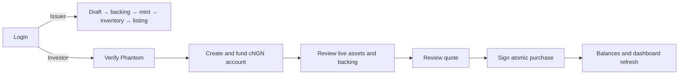

# Rabovel-FE

Rabovel FE is a Next.js App Router interface for the tokenized-equity demo. It presents separate issuer, investor and operations experiences and connects the primary demo journey to `rabovel-BE`.

The demo lets an issuer define an equity, submit simulated backing, create Token-2022 inventory and publish a listing. An investor can verify a Phantom wallet, create and fund a cNGN token account, review live listings and backing, settle a purchase on Solana, and see the resulting balance and portfolio value.

> Demo only: KYC, backing review and prices are simulated. Tokens do not establish legal ownership of real shares.

## Current experience



- **Authentication:** email/password sessions with role-based routing; mock credentials are available when mock mode is enabled.
- **Issuer workspace:** onboarding, asset creation/editing, simulated backing submission/review, mint setup, inventory issuance and live-listing status.
- **Investor workspace:** readiness guidance, Phantom ownership verification, cNGN setup, live assets, simulated prices, quotes, purchases and current holdings.
- **Operations UI:** admin, compliance, settlement and reconciliation screens remain largely fixture-backed demonstrations.
- **State:** TanStack Query manages server data and invalidation; Zustand persists the browser session; React Hook Form and Zod handle forms.

## Solana interaction

The browser never receives issuer or admin keys. Phantom signs two user-controlled actions:

1. A one-time message proving ownership of the Solana wallet linked to the Rabovel account.
2. A backend-prepared purchase transaction whose fee payer must match that linked wallet.

The purchase contains both the investor cNGN payment and issuer equity delivery. The backend partially signs the issuer leg; Phantom signs the investor leg before the frontend returns the serialized transaction for verification and submission. Confirmed purchases invalidate catalog data so wallet balances, holdings and issuer inventory refresh together.

## Run locally

```bash
pnpm install --frozen-lockfile
pnpm dev --port 3001
```

Create `.env.local` as needed:

```dotenv
NEXT_PUBLIC_USE_MOCK_API=false
NEXT_PUBLIC_API_BASE_URL=http://localhost:3000
NEXT_PUBLIC_ENVIRONMENT=development
```

`NEXT_PUBLIC_USE_MOCK_API` defaults to `true`. Real demo auth, wallet, issuer and purchase flows require it to be `false` and the backend to be running. Browser-exposed variables must never contain secrets.

See [commands](docs/commands.md) for verification and [architecture](docs/architecture.md) for source boundaries.

## Source layout

| Path | Purpose |
| --- | --- |
| `src/app` | Routes, layouts and page composition |
| `src/features` | Feature components, hooks and API adapters |
| `src/components` | Shared layout, UI and financial presentation |
| `src/types` | Frontend contracts |
| `src/stores` | Persisted browser state |
| `src/mocks` | Fixture data for incomplete/mock experiences |

## Known gaps

- Several admin, order, trade, settlement and historical-performance screens still use fixtures or legacy endpoints.
- The dashboard derives current holdings from live catalog balances; durable cost basis, P&L and transaction history are not yet available.
- cNGN funding uses an external devnet faucet; the app creates and displays the token account but does not mint payment funds.
- Backing is metadata rather than a stored document, and review is instant because there is no admin review portal.
- The price feed is deterministic and simulated, not licensed market data.
- Wallet and transaction flows require Phantom, funded Solana accounts and a correctly configured backend/network.
- No automated browser test suite currently exercises the complete issuer-to-investor journey.

## Future state

A production frontend could add regulated onboarding and document capture, real-time licensed prices, bank/payment rails, durable orders and settlement history, cost basis and performance reporting, corporate actions, secondary trading, accessibility/browser automation, and operational recovery views. Hardware-backed or custodian signing and explicit transaction simulation would complement the backend's future production custody model.
